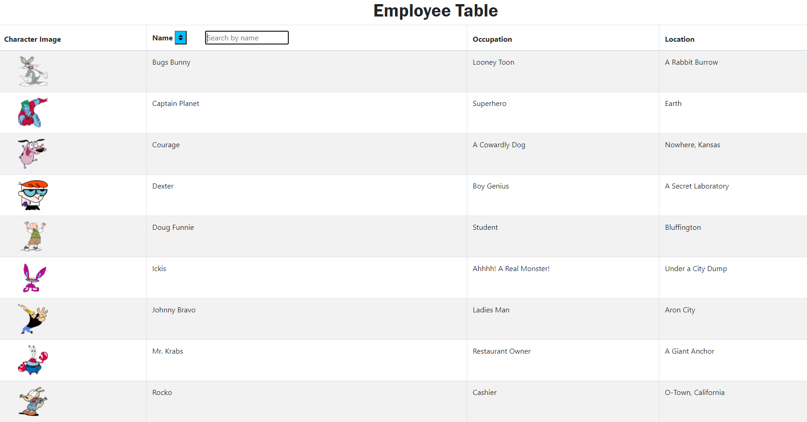

# employee-directory

## Description

This employee directory was created using React and allows users to sort and search based on the character name.

## Table of Contents

- [Installation](#installation)

- [Contributing](#contributing)

- [Usage](#usage)

- [License](#license)

- [Questions?](#questions)

## Installation

Type npm install in the terminal with correct working directory

## Usage

type 'node server.js' in the terminal (make sure the terminal directory is the correct path)

## License

The licensing for this application is through: MIT

## Contributions

Contribution is welcome for all interested parties

## Questions?

GitHub: http://github.com/thomasmaglaris
Email: thomasmaglaris@gmail.com

https://drive.google.com/file/d/1pmNii_UrZdFGftZgh7lKUfNSaeDOlED2/view
